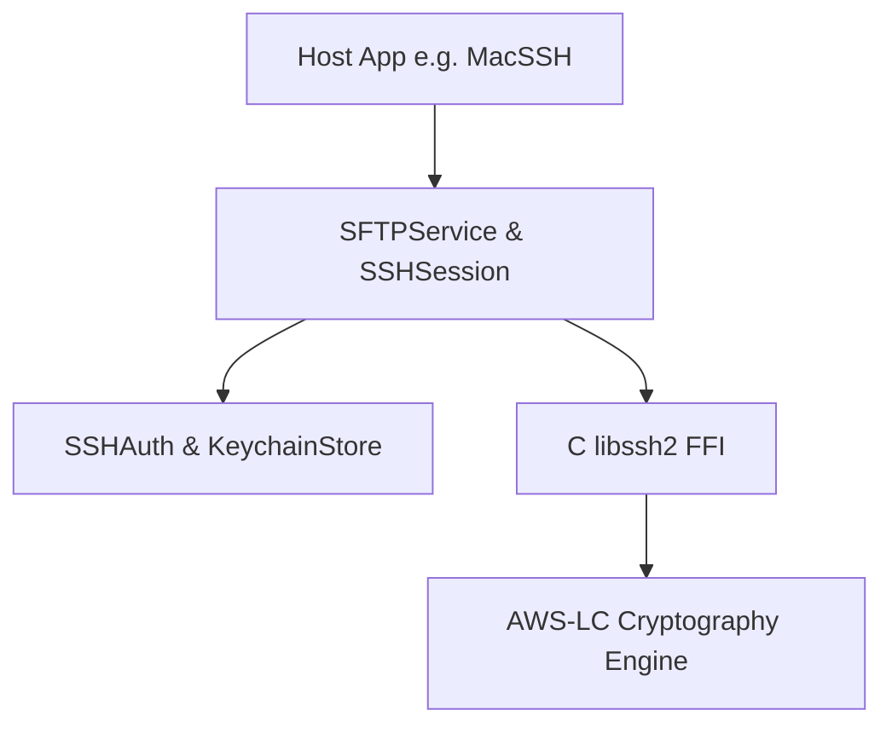

# System architecture

```mermaid
graph TD
    Host[Host App e.g. MacSSH] --> Service[SFTPService & SSHSession]
    Service --> Auth[SSHAuth & KeychainStore]
    Service --> FFI[C libssh2 FFI]
    FFI --> AWSLC[AWS-LC Cryptography Engine]
```
