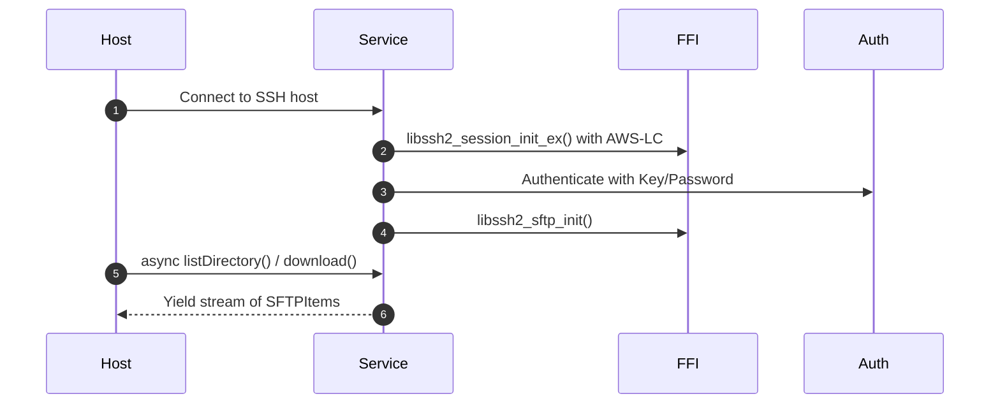

# Key flows

```mermaid
sequenceDiagram
    autonumber
    Host->>Service: Connect to SSH host
    Service->>FFI: libssh2_session_init_ex() with AWS-LC
    Service->>Auth: Authenticate with Key/Password
    Service->>FFI: libssh2_sftp_init()
    Host->>Service: async listDirectory() / download()
    Service-->>Host: Yield stream of SFTPItems
```
