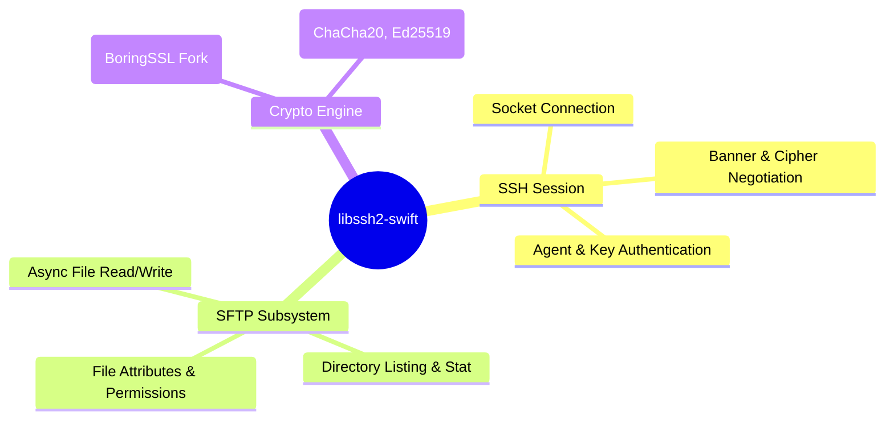

# Feature mindmap

```mermaid
mindmap
  root((libssh2-swift))
    SSH Session
      Socket Connection
      Banner & Cipher Negotiation
      Agent & Key Authentication
    SFTP Subsystem
      Async File Read/Write
      Directory Listing & Stat
      File Attributes & Permissions
    Crypto Engine
      AWS-LC (BoringSSL Fork)
      Modern Ciphers (ChaCha20, Ed25519)
```
